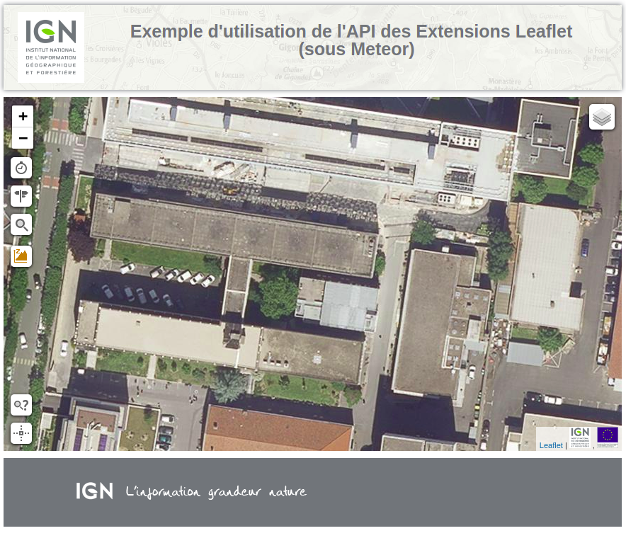
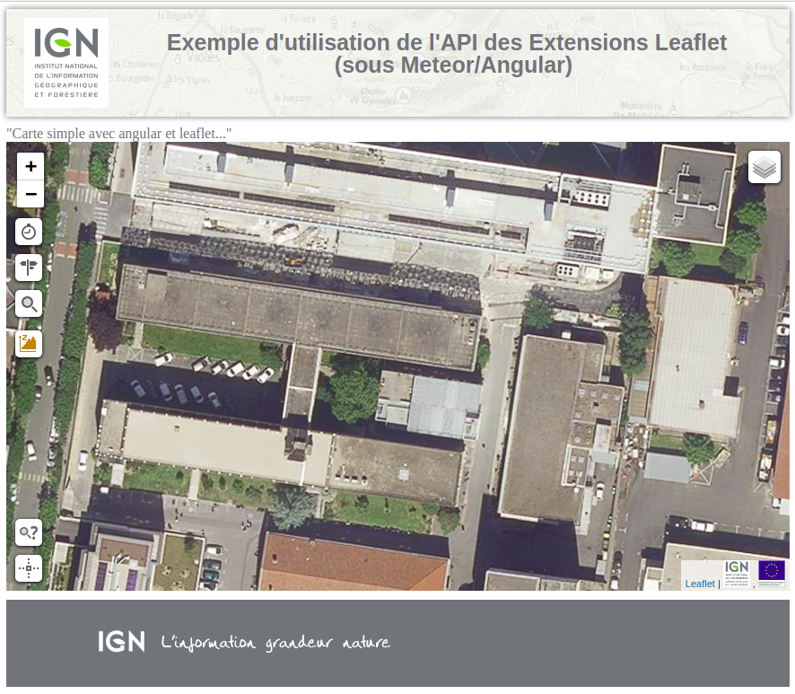
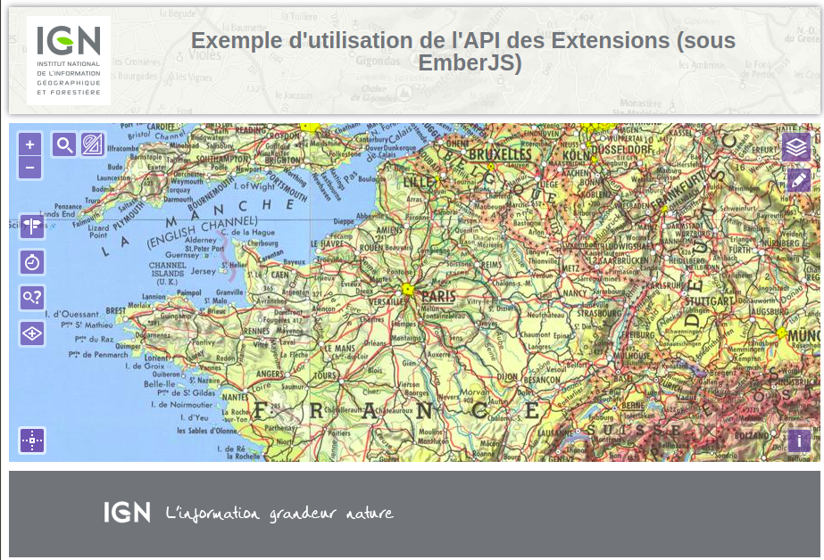
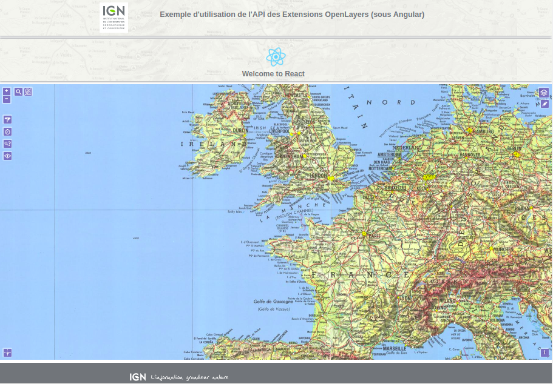
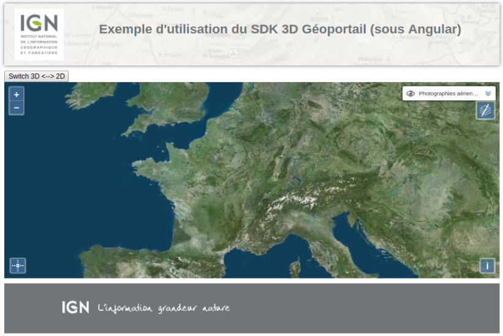

# 3rd Party Integration API Geoportail

Dépôt d'exemples d'intégration des API Géoportail dans differents frameworks
type "Web Framework Front-End JS", tels que Angular, React, Ember, Meteor, Vue...


## "Web Framework Front-End JS"

> **Liens utiles**

  https://github.com/collections/front-end-javascript-frameworks

  https://rubygarage.org/blog/best-javascript-frameworks-for-front-end

  http://blog.ippon.fr/2018/03/12/aide-au-choix-dun-framework-javascript/

_Listes des "Web Framework Front-End JS" utilisées dans les exemples :_

- React (https://reactjs.org/)
- Angular (https://angular.io/)
- Ember (https://www.emberjs.com/)
- Meteor (https://www.meteor.com/)
- VueJS (https://fr.vuejs.org/)


## API Géoportail

_Listes des API Géoportail utilisées dans les exemples :_

- Services
- Extensions
  - Leaflet
  - OpenLayers
  - Itowns (TODO)
- SDK
  - 2D (TODO)
  - 3D

## Listes des exemples

* _[samples-geoportal-access-lib-ember](https://github.com/IGNF/geoportal-third-party-integration/tree/master/samples-geoportal-access-lib-ember) :_

  Integration de l'API des Services avec Ember

* _[samples-geoportal-access-lib-es6-ember](https://github.com/IGNF/geoportal-third-party-integration/tree/master/samples-geoportal-access-lib-es6-ember) :_

    Integration de l'API des Services (ES6) avec Ember

* _[samples-geoportal-access-lib-vuejs](https://github.com/IGNF/geoportal-third-party-integration/tree/master/samples-geoportal-access-lib-vuejs) :_

    Integration de l'API des Services (ES6) avec VueJS

* _[simple-map-leaflet-meteor](https://github.com/IGNF/geoportal-third-party-integration/tree/master/simple-map-leaflet-meteor) :_

    Integration de l'API des Extensions Leaflet (ES6) avec Meteor

    ```
      // leaflet
      import L from "leaflet";
      import "leaflet/dist/leaflet.css";
      // extensions
      import { Services, LExtended } from "geoportal-extensions-leaflet";
      import "geoportal-extensions-leaflet/dist/GpPluginLeaflet-src.css";
    ```
    

* _[simple-map-leaflet-meteor-angular](https://github.com/IGNF/geoportal-third-party-integration/tree/master/simple-map-leaflet-meteor-angular) :_

  Integration de l'API des Extensions Leaflet (ES6) avec Meteor/Angular
  

* _[simple-map-leaflet-meteor-react](https://github.com/IGNF/geoportal-third-party-integration/tree/master/simple-map-leaflet-meteor-react) :_

  Integration de l'API des Extensions Leaflet (ES6) avec Meteor/React
  

* _[simple-map-openlayers-angular](https://github.com/IGNF/geoportal-third-party-integration/tree/master/simple-map-openlayers-angular) :_

  Integration de l'API des Extensions OpenLayers (ES6) avec Angular
  ```
  import {View, Map } from 'ol';
  import {Services, olExtended} from 'geoportal-extensions-openlayers';
  ```
  

* _[simple-map-openlayers-ember](https://github.com/IGNF/geoportal-third-party-integration/tree/master/simple-map-openlayers-ember) :_

  Integration de l'API des Extensions OpenLayers (ES6) avec Ember
  ```
  import {View, Map } from 'npm:ol';
  import {Services, olExtended} from 'npm:geoportal-extensions-openlayers';
  ```
  

* _[simple-map-openlayers-react](https://github.com/IGNF/geoportal-third-party-integration/tree/master/simple-map-openlayers-react) :_

  Integration de l'API des Extensions OpenLayers (ES6) avec React

  

* _[simple-map-SDK3D-angular](https://github.com/IGNF/geoportal-third-party-integration/tree/master/simple-map-SDK3D-angular) :_

  Integration de l'API SDK3D avec Angular
  
