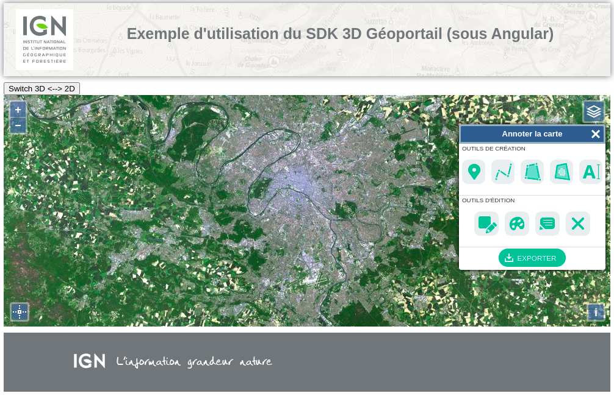

# Exemple d'application Angular avec l'API SDK du Geoportail.

## Creation d'un projet Angular

https://angular.io/guide/quickstart#first-component

https://github.com/angular/angular-cli

https://code.tutsplus.com/tutorials/creating-your-first-angular-app-components-part-1--cms-30113

## Installation des dépendences

> npm install

## Execution

> ng serve

ou

> npm run start

Puis ouvrir le navigateur sur l'url suivante : http://localhost:4200/



## FIXME

Pour une utilisation de "@ignf-geoportal/sdk-3d" < "3.2.0",
il faut mettre en place un patch pour utiliser le plugin sous Angular.
Ceci est causé par l'utilisation de la dependance *request* (dépréciée)...

Exception :
```
ERROR in ./node_modules/request/lib/har.js
Module not found: Error: Can't resolve 'fs' in './node_modules/request/lib'
ERROR in ./node_modules/forever-agent/index.js
Module not found: Error: Can't resolve 'net' in './node_modules/forever-agent'
ERROR in ./node_modules/tough-cookie/lib/cookie.js
Module not found: Error: Can't resolve 'net' in './node_modules/tough-cookie/lib'
ERROR in ./node_modules/tunnel-agent/index.js
Module not found: Error: Can't resolve 'net' in './node_modules/tunnel-agent'
ERROR in ./node_modules/forever-agent/index.js
Module not found: Error: Can't resolve 'tls' in './node_modules/forever-agent'
ERROR in ./node_modules/tunnel-agent/index.js
Module not found: Error: Can't resolve 'tls' in './node_modules/tunnel-agent'
```

patch :  
Dans le fichier "node_modules/@angular-devkit/build-angular/src/angular-cli-files/models/webpack-configs/browser.js" remplacer :
> node: false  

par :

```js
   >node: {  
            fs: 'empty',  
            global: true,  
            crypto: 'empty',  
            tls: 'empty',  
            net: 'empty',  
            process: true,  
            module: false,  
            clearImmediate: false,  
            setImmediate: false  
        }
```

cf. ISSUES : https://gist.github.com/niespodd/1fa82da6f8c901d1c33d2fcbb762947d

```bash
sed -i "s/node: false/node : {\n\t\tfs: 'empty',\n\t\tglobal: true,\n\t\tcrypto: 'empty',\n\t\t tls: 'empty',\n\t\tnet: 'empty',\n\t\tprocess: true,\n\t\tmodule: false,\n\t\tclearImmediate: false,\n\t\tsetImmediate: false\n\t}/" node_modules/@angular-devkit/build-angular/src/angular-cli-files/models/webpack-configs/browser.js
```

## Version du SDK

* Appel d'une version avec ol v5.3.0

Ex.

```json
"@ignf-geoportal/sdk-3d": "3.1.7"
```

* Appel d'une version avec ol v6.3.0

Ex.

```json
"@ignf-geoportal/sdk-3d": "3.2.0"
```

ou la version en cours de review...

```json
"@ignf-geoportal/sdk-3d": "https://raw.githubusercontent.com/IGNF/geoportal-sdk/upgrade_to_ol6/scripts/release/ignf-geoportal-sdk-3d-3.2.0.tgz"
```
