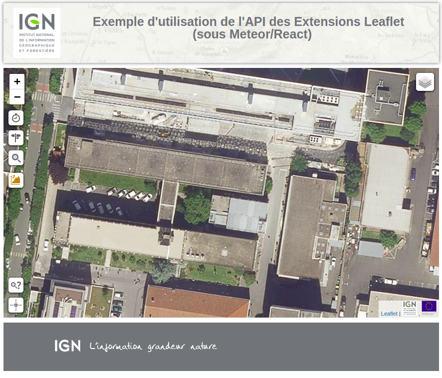

# Exemple d'application rapide (Meteor/React) avec les extensions Leaflet du Geoportail.

- tutoriel avec Meteor : 
https://www.meteor.com/tutorials/react/creating-an-app

- tutoriel d'utilisation des extensions leaflet Géoportail :
https://geoservices.ign.fr/documentation/utilisation_web/extension-leaflet.html

- github des extensions leaflet/openlayers Géoportail :
https://github.com/IGNF/geoportal-extensions

## Installation de Meteor (linux)

> curl https://install.meteor.com/ | sh

## Installation des dependances

> npm install

## Execution

> meteor

Puis ouvrir le navigateur sur l'url suivante : http://localhost:3000 

